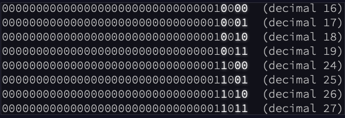

# Day 14 Commentary

## Input file processing

Given the linearity of the operations - mask, apply to some values, then
change the mask - I don't have much choice (in my personal requirements
of modularity to maintain the maximum flexibility across problem parts)
other than just read in the entire file and store the operations.

But, I'll save myself some constant text parsing by extracting out the
memory locations upon data read in.

So, the input file will get parsed into a list of tuples with the form:

- for type == 'mask' : (type, value)
- for type == 'mem' : (type, loc, value)

The interesting conundrum is what values to store. The mask is a ternary
list mask (X = dont care, 1 = force set to 1, 0 = force set to 0) so that
has to be stored as is. The memory location is easy as well: integer.

Memory values though. There is going to be a significant amount of bit math
going on but when does it make sense to convert between decimal (input and
output values).  For part 1, it seems pretty clear that there will only be
a single step where I need the memory value (decimal) represented in binary
(mask application) before storing the final value. Then there will be some
decimal math at the end.

My gut tells me to save the binary representation because there's going to
be a part 2 curve ball but - for part 1 - I'll store as a decimal.

## Part 1

Most of the challenge of part 1 is figuring out the data structure.  After
that, one simply has to figure out the means by which you are going to
accomplish the masking. I chose map+lambda in the following way:

```python
    result = map(
        lambda m, b: b if m == 'X' else m,
        mask, binary
    )
```

map() will simply create an iterable that will produce a value that is
obtained by passing the next value of all the passed iterables to the
function in the first arg. Clear, right?

In English, for a given iteration *i*, the i-th value returned by map
will correspond to the output of the function (in this case, the lambda
expression) when passed the i-th value of mask (referenced by *m*) and
the i-th value of binary (referenced by *b*)

The lambda function simply says that the first argument passed to it
is *m*, second argument is *b*, and the returned value is the result
of the expression after the **:**. This say that if the bit mask value
is 'X', return the value of the original bit.  Otherwise, return the
value in the bit mask itself.

There are the two details around conversions between bit strings and
integers.  To go from integer to bit string - padded to the correct
number of zeros so that this all works - simply to a format conversion:

```python
f'{decimal:036b}'
```

To convert back though isn't so intuitive, especially when there is a
deceptive alternative to the format option above:

```python
>>> bin(5)
'0b101'
```

One would think you could do a similar approach like:

```python
>>> int('0b101')
Traceback (most recent call last):
  File "<stdin>", line 1, in <module>
ValueError: invalid literal for int() with base 10: '0b101'
```

But as you can see, that fails to work.  The actual answer involves
an argument to the **int()** function - the 'base' with which to
convert. In short, the widely recognized prefixes of '0b' or '0x'
do not get leveraged by the **int()** function.  You must help it
out by provided the base.

```python
>>> int('0b101',2)
5
>>> int('0x101',16)
257
```

## Part 2

Fortunately, with part 2, I could re-use the input data structure I
built for part 1 but I had to significantly change how the processing
of that data occurred.

Because each 'X' now had to be factored in as both a *0* and a *1* and
all the combinations across the final memory address value, using map
and lambda wasn't necessarily flexible enough to be efficient.  I could
have kept it but then I'd need another loop to search for the 'X' values
and I wanted to be smarter.

The second question to be answered was - how was I going to implement
all those variations. If you stare at the example, at least the one I
was provided:



Looking just at the **X** positions and their changes, you'll notice
that the pattern is simply counting from 0 to 7 in binary:

```
0.00
0.01
0.10
...
```

My approach would then exploit that pattern by doing the following - as
I loop through the mask and binary positions ('manually' with a for loop),
store the index values of each position that had an 'X'.

The number of stored index values equates to the number of bits in the
counter I need to use. In the screenshot example above, that would be
3 bits where the stored indexes would be 33, 35, and 36 - in my solution,
all of my looping started at zero and referenced the most significant bit
first, unlike his problem description.

I create an outer loop over the range of that counter (e.g. for 3 bits,
the range would be 0-7).  Convert that counter to a bit string, e.g.
0 -> '000', 1 = '001'.

The i-th position in the bit string contains a 0 or 1 for the i-th value
in the stored index values... which corresponds to the actual index in
the address string.

```
var_mapping = '010'
var_index = [33, 35, 36]
result = '00000000000000000000000000000001X0XX'

# Iteration 1
var_mapping[0] = '0'
var_index[0] = 33
result[33] = '0'

# Iteration 2
var_mapping[1] = '1'
var_index[1] = 35
result[35] = '1'

(and so on)
```
